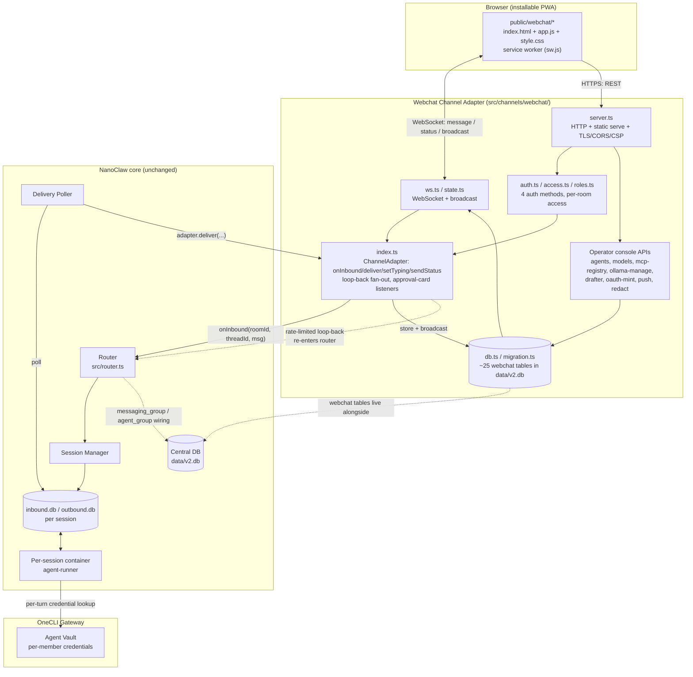
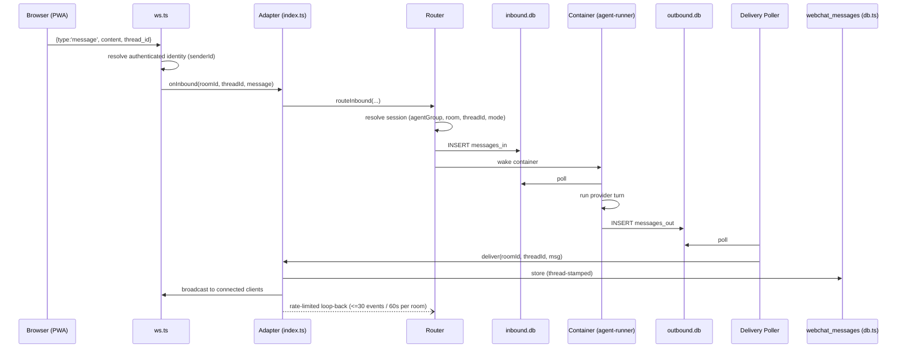
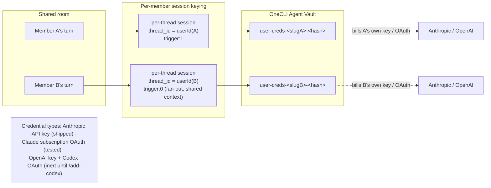
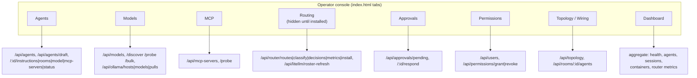
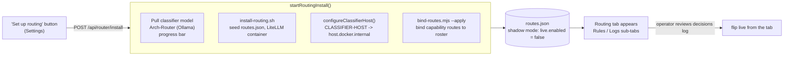

# Webchat Architecture Diagram

Webchat is a self-registering **channel adapter** — it plugs into NanoClaw's
normal router/session/delivery model exactly like Discord or Slack, but is the
only channel that also ships its own management surface (a PWA + operator
console) over an embedded HTTP + WebSocket server. This doc diagrams the
webchat-specific pieces; for the host/container/session model underneath it,
see the main [architecture diagram](../architecture-diagram.md). For the full
prose reference, see [webchat.md](webchat.md).

## System overview

## Message round trip

## Per-member user credentials

## Operator console -> REST surface

## Local-model routing install (one click)

---

*Two-DB session split and central-DB model are unchanged by webchat — it's a
consumer of them, not a new IO path. See
[../architecture-diagram.md](../architecture-diagram.md) for that part of the
picture.*
