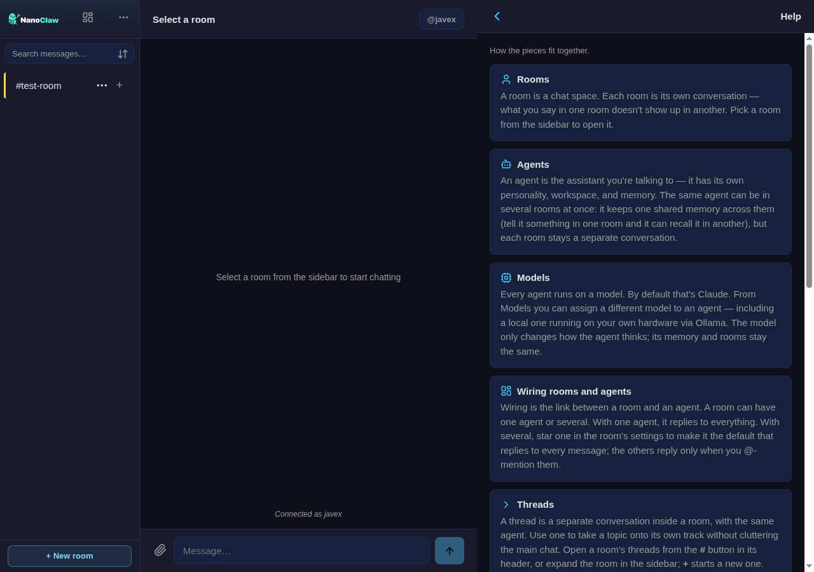
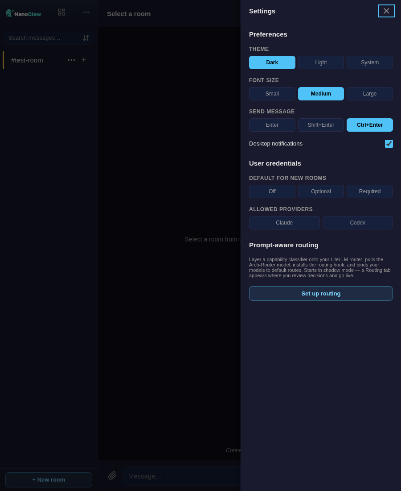
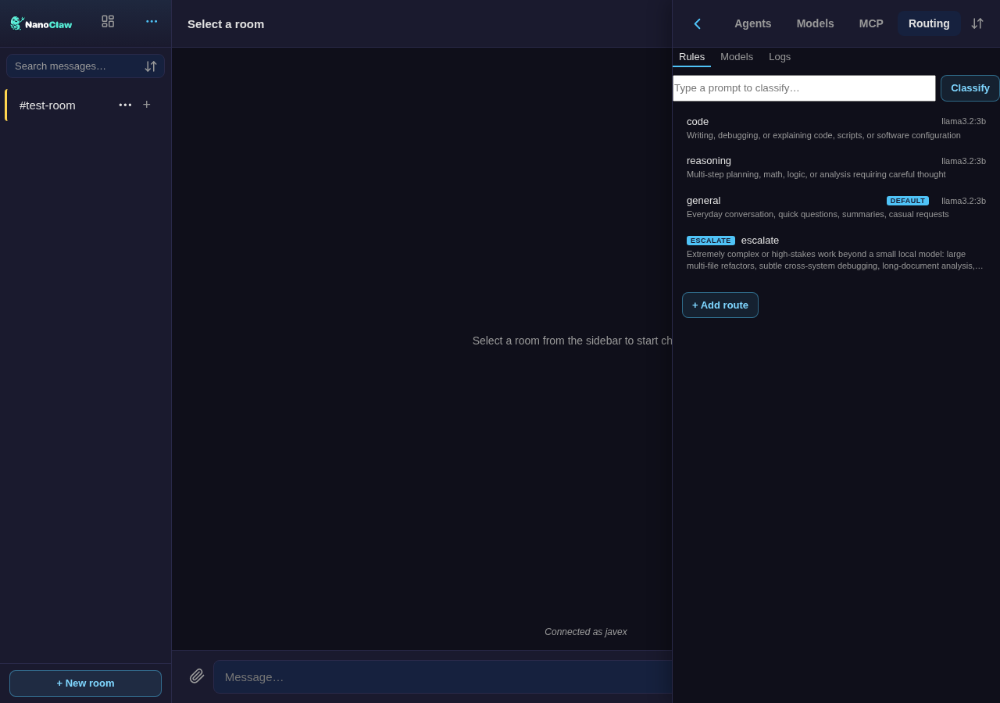
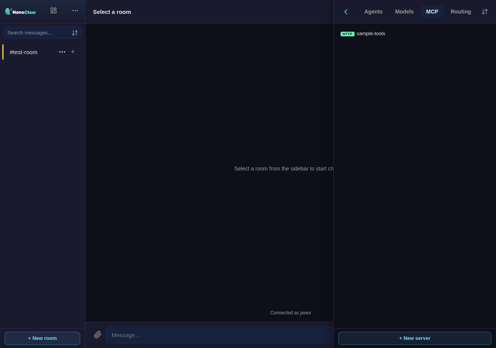
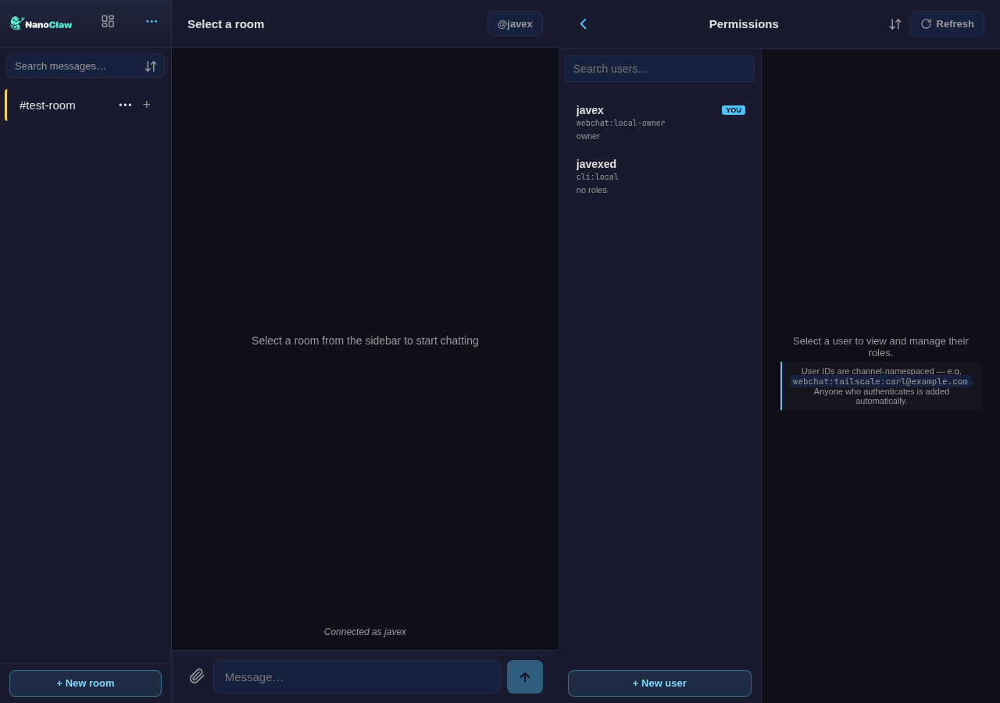
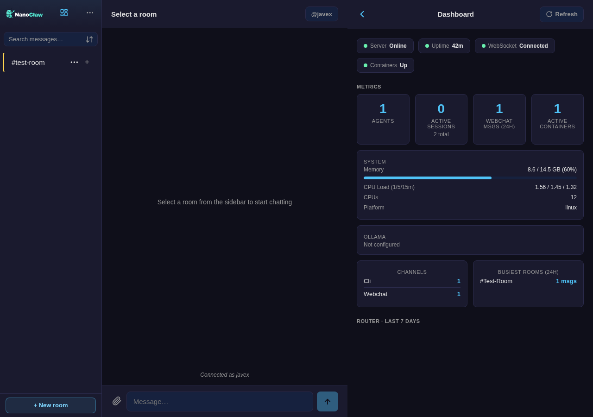

<!--
  Feature guide for the standalone webchat showcase repo.
  Screenshots live in ./screenshots/ (captured from a live install).
  Some shots (lobby/DM/approvals) come from a populated demo — see CAPTURE.md.
-->

# NanoClaw Webchat — Feature Guide

A local-first chat desk **and** operator console for your [NanoClaw](https://github.com/nanocoai/nanoclaw)
agents — one installable PWA bound to `127.0.0.1`. This guide walks the whole
surface: get it running, then a deep dive into each component.

> New here? The [README](./readme.md) is the one-page pitch; this is the tour.
> For architecture + APIs, see the [design doc](./webchat.md).

---

## Getting started

**You need** a working NanoClaw fork (Node + pnpm) with at least one connected
model. Webchat is a **channel you add** to your fork — not a separate app.

**Install** — from Claude Code in your fork:

```bash
git clone <nanoclaw-webchat repo> && cd nanoclaw-webchat
bash install.sh --dir ~/nanoclaw      # composes nanoclaw + hook seam + webchat
cd ~/nanoclaw && bash configure-webchat.sh   # auth, TLS, Web Push
# start the host, then open  http://127.0.0.1:3100
```

**First run.** Open `http://127.0.0.1:3100`. On localhost you're signed in as the
**owner** automatically — no password. The left sidebar is your rooms; the top-left
**⊞** and **⋯** open the operator surfaces (Agents, Models, MCP, Auto routing, Dashboard,
Permissions, Wiring, Settings, Help).

**Not sure how the pieces fit?** The built-in **Help** page explains the model in
plain language — rooms, agents, models, wiring, threads.



Create an agent from the **Agents** tab (or draft one from a prompt), wire it to a
room, and start chatting. Everything below is reachable from the same console.

---

## Chat

The everyday surface — a familiar chat client, but every participant is one of your
agents.

- **Rooms & the lobby** — each room is its own conversation. Route to an agent with
  an `@mention`; rooms are mention-only, with an optional **"prime"** catch-all
  agent per room. Pin / archive / hide / drag-reorder; per-room color.
- **Per-agent DMs** — a direct 1:1 room per agent.
- **Threads** — a thread *is* its own agent session (isolated context and memory)
  inside a room. Sidebar-nested; `main` is pinned; create / rename / delete;
  per-thread unread. **Context sync** pulls or pushes a verbatim slice of one
  thread's history into another without duplicating.
- **Markdown, attachments, live activity** — GFM with code-copy; drag-and-drop
  uploads (chunked/resumable for large files) with an image lightbox; a per-turn
  **"thinking" bubble** streaming the agent's tool/reasoning feed, with an
  **interrupt** button.
- **Search** — full-text (SQLite FTS5) across the rooms you can see.
- **PWA** — installable, offline-capable, with Web Push notifications and light /
  dark / system themes.

---

## Agents

Create, wire, and tune agents entirely in the browser. The settings panel is a
two-tab layout — **Settings** (status pills, name, the model picker, and MCP-servers
/ Rooms attach accordions via one shared picker) and **Instructions** — and you can
**draft a new agent from a prompt** (host-side, via OneCLI).


Clicking an agent inside a room's settings (or a room inside an agent's) jumps
straight to that entity.

---

## Models

Every agent runs on a model — Claude by default. From the **Models** tab you
register model endpoints and assign them per agent:

- **Register** `anthropic` / `ollama` / `openai-compatible` models, with **live
  discovery + probe** (races http/https and Ollama, classifies the provider) and
  bulk-register. All operator-supplied URLs pass an **SSRF guard**.
- **Assign per agent** — the assignment writes an env override into the group's
  settings; the container picks it up on its next spawn. The agent's picker shows
  the effective model even when none is explicitly assigned (its *auto-detected*
  runtime model).
- **Ollama host management** — list hosts, stream model **pulls** with a progress
  bar, and refresh the router roster.

*(`openai-compatible` models require `/add-litellm`, which fronts them on the default Claude harness.)*

---

## User credentials

In a shared room, each member can connect **their own** Anthropic API key. Their
turns then run in a container bearing **their own** OneCLI credential identity — so
usage bills to their account, and nothing is shared or replayable. Keys go straight
to the OneCLI vault; the host never holds them.



- **Per-room mode** — `disabled` / `optional` / `required` (default off), plus which
  credential types a room allows.
- **Workspace policy** — a default mode and the permitted credential types
  (out of the box: Anthropic key only).
- **Safety** — onboarding is bound to the authenticated user (never body-supplied),
  room-access + CSRF gated, and rate-limited.

---

## OAuth (subscription sign-in)

Beyond raw API keys, a member can connect a **Claude subscription** (or a Codex
ChatGPT subscription) by signing in — no key to copy. The browser mint runs
`claude setup-token` / `codex login` inside a throwaway container and captures the
device-auth URL + token, storing it in the vault like any other credential.

> **Status: prototype.** The OAuth/subscription mint is an early, best-effort flow
> (a PTY screen-scrape of the CLI's output) and isn't yet as robust as the API-key
> path. Codex / OpenAI credential types stay inert until `/add-codex`.

---

## Local-model routing

Route each turn to the *right* model — send the simple ones to a small local model,
keep a frontier model for the hard ones. The whole stack installs with **one click**:

- **"Set up auto routing"** in Settings (see the shot above) pulls the **Arch-Router**
  classifier (with a progress bar), runs the installer, points the classifier at
  your Ollama, and **auto-binds** the default routes to your roster — no shell.
- The **Auto routing tab** then appears, with **Rules / Models / Logs** sub-tabs: a routes
  editor (each capability route — code / reasoning / general / … — bound to a model),
  a live **classify test bench**, per-route suggestions when a roster model has an
  uncovered capability, a **decisions log**, and shadow-vs-live **metrics**.



It starts in **shadow mode** — every request is classified and logged, but nothing
about routing changes — so you can calibrate risk-free, then flip it **live** from
the tab. *(Or install via `/add-litellm` + `/add-routing` instead of the button.)*

You can define **more than one routing profile** — a picker (New / Delete) at the top
of the tab creates named routers (`auto`, `auto-vision`, `auto-cheap`, …), each with
its own rules and bindings but all sharing the one classifier and roster. An agent
picks a profile by which virtual model it's assigned; **New** clones the current
profile and registers it as an assignable model, so you never edit JSON.

---

## MCP servers

Give an agent extra tools by attaching **MCP servers**. From the **MCP** tab you
register a server (stdio, SSE, or Streamable HTTP) and **probe** it — a real MCP
client connects and lists its tools before you attach it, so a broken endpoint is
caught up front. From an agent's settings you attach/detach servers through the
shared picker, including a **"+ Add new server"** create-then-attach flow (visible
in the agent panel above). Attachments sync into the agent group's container config,
co-existing with any servers added via `ncl`.



*Try it in a minute:* a tiny sample server (`echo` / `add` / `current_time` /
`roll_dice`) is one file — see [a minimal Streamable-HTTP MCP server](#a-minimal-sample-mcp-server)
below — run it, register `http://127.0.0.1:8765/mcp` in the MCP tab, and probe.

---

## Permissions & roles

Manage who can do what, in the browser.



- **Roles** — owner / admin, **global or scoped** to an agent group. The first
  authenticated identity is auto-granted owner.
- **Members** — per-agent-group access; member grants are delegable to scoped admins,
  while role grants stay owner-only.
- **Approvals inbox** — an interactive approve/reject inbox for credentialed actions,
  surfaced both in-room and in a per-approver DM inbox.

---

## Wiring & topology

See and edit which agents and models are reachable from which rooms. The **Wiring**
matrix is a rooms × agents grid — tap a cell to wire or unwire; an agent's model
shows under its name. A **Topology** view renders the same as a Rooms → Agents →
Models graph.


---

## Dashboard

A live operator overview: a health strip (server / uptime / WebSocket / containers),
metric tiles (agents, active sessions, messages, containers), system resources,
per-channel activity, busiest rooms, and — once routing is installed — a router
traffic panel.



---

## Security & identity

Built to be exposed carefully, or not at all:

- **Localhost-first** — binds `127.0.0.1:3100` by default and refuses a public
  interface unless an explicit auth method is set.
- **Authentication** — localhost owner · Tailscale identity · bearer token · SSO /
  reverse-proxy headers (Entra ID, Cloudflare Access…). Each auto-enables from its
  env var; localhost auto-owner switches off the moment any explicit method exists.
- **Hardening** — an `X-Webchat-CSRF` header on every mutation, same-origin CORS,
  strict CSP; **SSRF guards** on every operator-supplied URL; secret **redaction** on
  every broadcast and push payload; optional TLS.
- **Credentials** — injected per-request by the OneCLI gateway; never in env or chat.

---

## A minimal sample MCP server

Want something to attach right away? This is a complete Streamable-HTTP MCP server
in one file, no build step — it exposes four trivial tools. Save it, `node` it, then
register `http://127.0.0.1:8765/mcp` (transport **http**) in the MCP tab and probe.

```js
// sample-mcp.mjs — run: node sample-mcp.mjs  (needs @modelcontextprotocol/sdk on the path)
import http from 'node:http';
import { Server } from '@modelcontextprotocol/sdk/server/index.js';
import { StreamableHTTPServerTransport } from '@modelcontextprotocol/sdk/server/streamableHttp.js';
import { ListToolsRequestSchema, CallToolRequestSchema } from '@modelcontextprotocol/sdk/types.js';

const TOOLS = [
  { name: 'echo', description: 'Echo back the text you send.',
    inputSchema: { type: 'object', properties: { text: { type: 'string' } }, required: ['text'] } },
  { name: 'add', description: 'Add two numbers.',
    inputSchema: { type: 'object', properties: { a: { type: 'number' }, b: { type: 'number' } }, required: ['a', 'b'] } },
  { name: 'current_time', description: 'Current server time (ISO 8601).', inputSchema: { type: 'object', properties: {} } },
  { name: 'roll_dice', description: 'Roll an N-sided die (default 6).',
    inputSchema: { type: 'object', properties: { sides: { type: 'number' } } } },
];

function makeServer() {
  const s = new Server({ name: 'sample-mcp', version: '1.0.0' }, { capabilities: { tools: {} } });
  s.setRequestHandler(ListToolsRequestSchema, async () => ({ tools: TOOLS }));
  s.setRequestHandler(CallToolRequestSchema, async ({ params: { name, arguments: a = {} } }) => {
    const text =
      name === 'echo' ? String(a.text ?? '') :
      name === 'add' ? String(Number(a.a) + Number(a.b)) :
      name === 'current_time' ? new Date().toISOString() :
      name === 'roll_dice' ? String(1 + Math.floor(Math.random() * (Number(a.sides) || 6))) :
      (() => { throw new Error(`Unknown tool: ${name}`); })();
    return { content: [{ type: 'text', text }] };
  });
  return s;
}

http.createServer(async (req, res) => {
  if (!req.url?.startsWith('/mcp')) { res.writeHead(404).end('POST /mcp'); return; }
  const chunks = []; for await (const c of req) chunks.push(c);
  const body = chunks.length ? JSON.parse(Buffer.concat(chunks).toString()) : undefined;
  const transport = new StreamableHTTPServerTransport({ sessionIdGenerator: undefined }); // stateless
  res.on('close', () => transport.close());
  await makeServer().connect(transport);
  await transport.handleRequest(req, res, body);
}).listen(8765, '127.0.0.1', () => console.log('sample MCP on http://127.0.0.1:8765/mcp'));
```

> An agent runs inside a container, so to have an *agent* call it (not just probe it
> from the host), register the URL as `http://host.docker.internal:8765/mcp` instead.

---

*Architecture, the full REST surface, storage, and the ship model:
**[docs/webchat/webchat.md](./webchat.md)**.*
