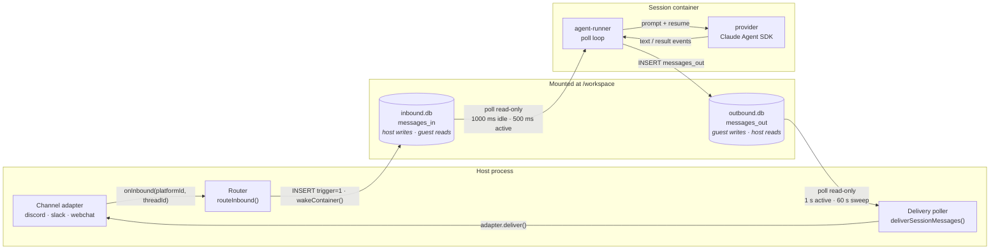
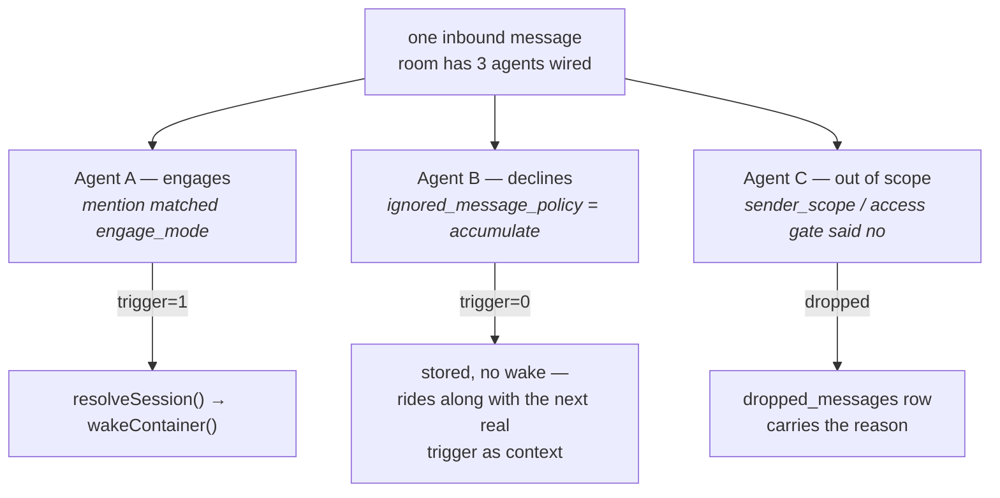
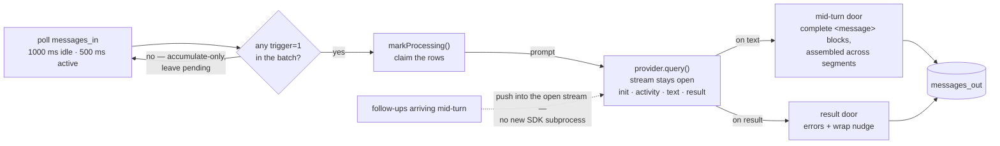

# The Message Path

How a chat message reaches the model and the reply comes back — adapter,
router, session container, turn, delivery. Webchat is one channel adapter on
this path; everything from the router inward is nanoclaw core and is identical
for Discord, Slack, or a scheduled task.

This is the host/container/session companion to
[architecture-diagram.md](architecture-diagram.md), which diagrams the
webchat-specific pieces sitting on top of it.

> Line numbers below were accurate at the commit that added this doc and will
> drift. The file paths won't; when a number is stale, grep the symbol name.
> Host code is `src/`, guest code is `container/agent-runner/src/`, both in
> nanoclaw itself (the install output), not in this repo.

## The invariant: two files, one writer each

Host and container share no IPC, no stdin pipe, no socket. They share two
SQLite files:

| File | Table | Written by | Opened by |
|---|---|---|---|
| `inbound.db` | `messages_in` | host | container, read-only |
| `outbound.db` | `messages_out` | agent-runner | host, read-only |

One writer per file is the point — nothing contends for a lock across the
mount. `inbound.db` also carries host-written lookup tables the container reads
live (`destinations`, `session_routing`, `delivered`); `outbound.db` carries
the container-owned `processing_ack`, `session_state` and `container_state`.

Both run `journal_mode=DELETE`, **not** WAL. WAL coordinates readers and
writers through a memory-mapped `-shm` file, and that coherency does not
propagate across VirtioFS: a WAL reader in the guest would pin an early
snapshot and never see another host write. DELETE journalling costs throughput
and buys a seam that works.

Every kind of traffic is a row in one of those two tables — chat, scheduled
tasks, webhook payloads, agent-to-agent calls, system actions. There is no
second IO path.



The delivery ack lives in `inbound.db`'s `delivered` table — host-owned, so the
record of what has already gone out stays on the host's side of the mount.

## 1. Channel adapter

`src/channels/adapter.ts` — the `ChannelAdapter` interface.

An adapter receives platform events, decides which are worth forwarding (regex
trigger, `@mention`, subscribed thread — core neither knows nor cares how), and
reports two identifiers upward:

- `platformId` — the conversation (Slack channel, WhatsApp group, webchat room)
- `threadId` — an optional sub-context, or null

It also **declares** `supportsThreads`. Discord and Slack say true, so one
thread is one session; Telegram and WhatsApp say false, and the router nulls
thread ids on arrival. Outbound it implements `deliver(platformId, threadId,
message)`, plus optional `setTyping` and `sendStatus` where the platform has a
surface for them.

What an adapter never sees is an agent group or a session. Those are host
concepts, resolved after the adapter has done its job — which is why webchat,
despite shipping its own HTTP+WS server and operator console, looks exactly
like Discord from the router's side. Webchat additionally re-enters the router
with agent output (rate-limited to 30 events / 60 s per room) so agents in a
shared room can address one another.

## 2. Router and fan-out

`src/router.ts` — `routeInbound()`, then `deliverToAgent()`.

The order is fixed and most messages leave early:

1. Registered interceptors get first refusal — an approval flow consumes its
   own free-text replies before routing happens.
2. The receiving adapter's thread policy is applied.
3. One combined query fetches the `messaging_groups` row **and** counts wired
   agents. An unwired channel costs a single read and exits. No row plus a
   mention auto-creates the group; no row plus plain chatter is silence.
4. A known channel with zero wired agents either drops the message or
   escalates it to the owner as a channel-registration request.
5. Sender resolution produces a `userId` (and upserts the user row as a side
   effect, so later role lookups find a record).
6. Fan-out: every wired agent is judged independently.

Step 6 has **three** outcomes, not two:



The middle path is the one that surprises people: an agent that chose not to
answer still receives the message at `trigger=0`, so when it does engage later
the room's history is already in its session rather than lost. The guest honors
the same contract — a batch containing only `trigger=0` rows does not start a
turn (`poll-loop.ts`), and `countDueMessages` gates wake-from-cold the same way
host-side.

Downstream, `deliverToAgent()` resolves which session the row lands in.
`session_mode` is `shared`, `per-thread` or `agent-shared`; a thread-enabled
wiring in a group chat is forced to `per-thread` regardless. Installed modules
can override the session key entirely — which is how per-member credentials
work (see below), and how a module can veto a turn before any session exists.

## 3. Session container

`src/container-runner.ts` — `wakeContainer()`, `spawnContainer()`,
`buildMounts()`.

An **agent group** owns a folder, a composed `CLAUDE.md`, skills and container
config. A **session** is one container running that filesystem with its own
mounted DB pair. Many sessions share one group — same skills, same
instructions, separate conversations.

`wakeContainer()` is idempotent: already running, or a wake already in flight,
both short-circuit onto the existing promise. A cold spawn does this first, so
admin changes take effect on wake rather than on restart:

- Refresh `destinations`, room humans and `session_routing` into `inbound.db`.
- Materialize `container.json` from the DB; recompose `CLAUDE.md` from the
  shared base, enabled skill fragments and MCP server instructions.
- Mount the session dir at `/workspace` (both DBs, `outbox/`, `.heartbeat`) and
  the group folder at `/workspace/agent` read-write — then nest
  `container.json`, `CLAUDE.md` and `plugins/` back on top **read-only**, so
  the agent can read its own configuration but not rewrite it.
- Ask the OneCLI gateway for its per-session contribution. This is
  **fail-closed**: no credentials applied means no spawn, the inbound row stays
  pending, and the sweep retries.

Three consecutive spawn failures post one notice into the room explaining the
silence. The alternative — a room that simply looks dead while the credential
gateway is down — is the worst failure mode the system has.

## 4. The turn

`container/agent-runner/src/poll-loop.ts` — `runPollLoop()`, then
`processQuery()`.



On start the loop clears stale `processing` acks left by a crashed predecessor
and resumes the stored continuation — rotating it away first if the transcript
has grown too large or too old to cold-resume inside the host's idle ceiling,
which is what stops a long-lived hub from looping forever on a transcript it
can never finish loading.

Two properties worth knowing:

- **The stream is not closed between turns.** Reopening it would re-spawn the
  SDK subprocess and reload the transcript on every message. It costs nothing
  on the cache side — the prompt cache is server-side and keyed on prefix hash,
  not on connection lifetime. Liveness is judged from outside instead (§6).
- **Content is delivered exactly once, decided by the outbound seq high-water
  mark** rather than an in-process ledger. For providers that stream text
  (Claude does), mid-turn is the single content door and the final result
  carries only errors plus the wrap-nudge decision; for those that don't, the
  polarity flips and the result becomes the only door. An empty turn is
  detectable as a zero delta in the outbound sequence with no terminal error.

`/clear` is handled in the runner itself — it drops the continuation. Filtered
and unauthorized admin commands never get this far; the host's command gate
classifies them before the row is written.

## 5. The call to the model

`container/agent-runner/src/providers/claude.ts` — `query()`.

Provider-wide settings (MCP servers, env, model, effort, assistant name) arrive
in the constructor; only what changes turn to turn is passed per query.

```ts
sdkQuery({
  prompt: stream,
  options: {
    cwd, resume: continuation,          // the SDK's own .jsonl transcript
    model, effort,
    pathToClaudeCodeExecutable: '/pnpm/claude',
    systemPrompt: { type: 'preset', preset: 'claude_code', append: instructions },
    allowedTools: [...TOOL_ALLOWLIST, ...mcpAllowEntries],
    permissionMode: 'bypassPermissions',
    mcpServers,
    hooks: { PreToolUse, PostToolUse, PostToolUseFailure, PreCompact },
  },
})
```

Three things worth knowing:

- **Context lives in `resume`.** The poll loop treats the continuation as an
  opaque token and keys it per provider, so a Codex thread id can never be
  handed to Claude.
- **The lenient path.** For Ollama-backed agents the `claude_code` preset is
  dropped and the persona/destinations addendum becomes the entire system
  prompt. The preset's agentic tool-protocol scaffolding overwhelms small local
  models into narrating internals and hallucinating tool calls. The host sets
  `lenientPrompt` for those agents, mirroring `lenientOutput`.
- **The API key is not in the container.** Agents sit on a Docker `--internal`
  network with no route out (`src/egress-lockdown.ts`); the OneCLI gateway is
  the only reachable hop and rewrites the `Authorization` header on the wire.
  The container gets `ANTHROPIC_BASE_URL` and
  `ANTHROPIC_AUTH_TOKEN=placeholder` — just enough for the SDK to emit a header
  for the proxy to overwrite. Non-root, no `NET_ADMIN`, so the agent cannot
  undo it.

The SDK event stream is translated into four provider events — `init`,
`activity`, `text`, `result` — so the poll loop learns nothing
Claude-specific. `activity` fires on **every** SDK message; that is what keeps
`.heartbeat` fresh and the host watchdog off the container's back.

Per-member credentials fall out of the session-key override in §2: a module
re-keys the session by `userId`, so two people in one room run in two sessions
of the same agent group — same filesystem, different DB pair, different vault
entry substituted at the proxy. See
[user-credentials.md](user-credentials.md) and the keying diagram in
[architecture-diagram.md](architecture-diagram.md#per-member-user-credentials).

## 6. Delivery, and liveness

`src/delivery.ts` — `deliverSessionMessages()`. `src/reconcile-session.ts` —
`decideStuckAction()` and the watchdog constants, called from `src/host-sweep.ts`.

Two pollers run on the host: active sessions at 1 s, a sweep across everything
else at 60 s. Delivery reads due rows from `outbound.db`, subtracts the
`delivered` set held in `inbound.db`, and calls the adapter for each remaining
row — recording the platform message id alongside the ack where the platform
returns one. Re-entry on the same session is rejected outright, so two
overlapping polls cannot double-deliver.

Containers are **not** killed on a timer. A 60 s sweep asks two questions: is
`.heartbeat` older than the ceiling, and has any claimed message sat
unacknowledged past the tolerance without a sign of life? Either answer kills
the container; pending rows stay pending and the next inbound wakes a fresh
one. Two consecutive ceiling kills that produced no output are read as a
continuation too bloated to process within the ceiling — every turn just
recompacts and dies — so the continuation is cleared and the next turn starts
fresh.

| Constant | Value | Governs |
|---|---|---|
| `POLL_INTERVAL_MS` | 1000 ms | guest polls `messages_in` while idle |
| `ACTIVE_POLL_INTERVAL_MS` | 500 ms | guest polls while a query is live, to push follow-ups |
| `ACTIVE_POLL_MS` | 1000 ms | host drains `outbound.db` for active sessions |
| `SWEEP_POLL_MS` | 60 s | host sweep across all other sessions |
| `ABSOLUTE_CEILING_MS` | 30 min | heartbeat age past which a container is killed |
| `CLAIM_STUCK_MS` | 60 s | tolerance per processing claim with no signs of life |
| `CEILING_HEAL_STREAK` | 2 | ceiling kills with no output before the continuation is cleared |
| `SPAWN_FAILURE_NOTICE_AT` | 3 | failed spawns before one notice is posted to the room |
| `MAX_TRIES` / backoff | 5 · 5 s | delivery retries before a row is abandoned |

A declared long `bash` timeout raises both the ceiling and the claim tolerance
for that container, so a legitimately long tool call is not mistaken for a
hang.

## File index

| Path | Owns |
|---|---|
| `src/channels/adapter.ts` | the `ChannelAdapter` contract every platform implements |
| `src/router.ts` → `routeInbound` | lookup, auto-create, fan-out |
| `src/router.ts` → `deliverToAgent` | session mode, key override, the inbound write |
| `src/container-runner.ts` → `wakeContainer` | spawn, idempotent wake, spawn-failure notice |
| `src/container-runner.ts` → `buildMounts` | what the container can see |
| `src/host-sweep.ts` / `src/reconcile-session.ts` | the watchdog sweep / its kill decisions and constants |
| `src/delivery.ts` | draining `outbound.db` back to the adapter |
| `src/gateway-providers/onecli.ts` | credential contribution, fail-closed |
| `src/egress-lockdown.ts` | the internal network, and why the proxy is the only hop |
| `container/agent-runner/src/poll-loop.ts` → `runPollLoop` | the poll loop and batch gate |
| `container/agent-runner/src/poll-loop.ts` → `processQuery` | the turn, both delivery doors |
| `container/agent-runner/src/providers/claude.ts` | the SDK call |

One caveat on nanoclaw's own prose docs: `docs/architecture.md` states that
scheduling MCP tools write `inbound.db` directly. They do not — they emit
`messages_out` system actions that the host applies. The doc flags its own
drift at the top, but that passage is the one that misleads.
